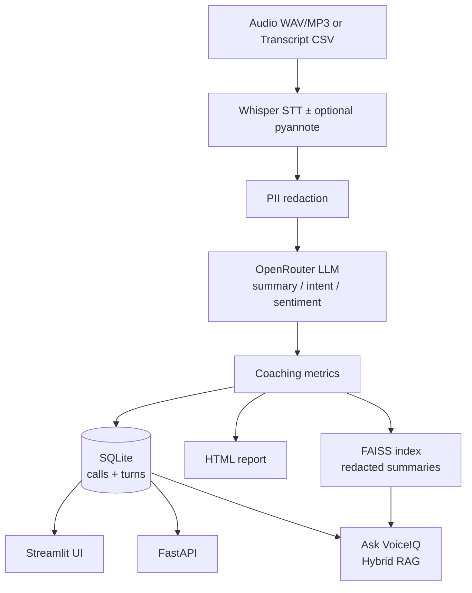
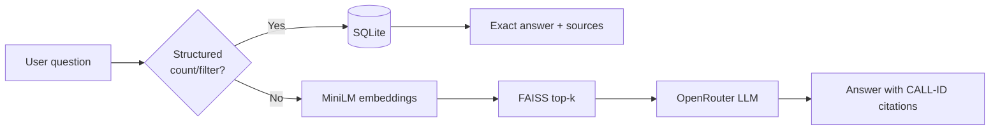

# VoiceIQ

**Pharmacy support-call intelligence** — turn call audio/transcripts into redacted summaries, coaching metrics, SQLite analytics, and hybrid RAG Q&A for managers and QA coaches.

[](https://github.com/navyachiitkgp/AIAgent-customer-support/actions/workflows/ci.yml)
[](https://www.python.org/downloads/)
[](LICENSE)
[](docker-compose.yml)

> **Live demo:** run locally with Docker / Streamlit (below). Cloud host (HF Spaces / Render) is listed under [Future Work](#future-work).

---

## Demo


[Download MP4 (~60s)](docs/voiceiq_demo.mp4) · Walkthrough: **Analyze → Dashboard → Call detail → Ask VoiceIQ → Batch**

---

## Features

| Feature | What it does |
|---------|----------------|
| **End-to-end pipeline** | Audio/CSV → Whisper STT → PII redact → LLM summary/intent/sentiment → coaching metrics |
| **Privacy-first** | Regex PII redaction before LLM calls and vector indexing |
| **Coaching metrics** | Talk ratio, interruption proxy, resolved / escalated heuristics |
| **Hybrid RAG** | SQL for exact counts/filters + local MiniLM + FAISS for free-text Q&A with call-ID citations |
| **Product UI** | One Streamlit app: Analyze, Dashboard, Call detail, Ask, Batch inbox |
| **API** | FastAPI: health, calls, transcribe, summarize, search |
| **Batch jobs** | Drop files in `data/inbox/` → `python -m voiceiq.batch` |
| **Eval + CI** | Labeled 10-call eval, pytest, GitHub Actions, Docker Compose |

---

## Architecture

Recruiters: start here. Full pipeline:



**Hybrid RAG (Ask VoiceIQ):**



**Stack at a glance:** Streamlit / FastAPI → `voiceiq` pipeline → Whisper → OpenRouter (`gpt-4o-mini`) → SQLite + FAISS (`all-MiniLM-L6-v2`).

---

## Tech Stack

| Layer | Choice |
|-------|--------|
| UI | Streamlit |
| API | FastAPI + Uvicorn |
| DB | SQLite |
| LLM gateway | OpenRouter (`openai/gpt-4o-mini`) |
| Embeddings | `sentence-transformers/all-MiniLM-L6-v2` (local CPU) |
| Vector store | FAISS |
| STT | OpenAI Whisper (`base`) |
| Diarization (optional) | pyannote 3.1 |
| Ops | Docker Compose, GitHub Actions |

---

## Installation

### Option A — Docker (recommended)

```bash
cp .env.example .env   # set OPENROUTER_API_KEY
docker compose up --build
```

- UI: http://localhost:8501  
- API: http://localhost:8000/docs  

### Option B — Local venv (no heavy audio stack)

```bash
python3 -m venv venv && source venv/bin/activate
pip install -r requirements-core.txt
cp .env.example .env   # set OPENROUTER_API_KEY
bash scripts/demo.sh
./venv/bin/streamlit run app.py
```

### Full audio (Whisper)

```bash
pip install -r requirements-audio.txt
# brew install ffmpeg   # for mp3; wav works without it
```

---

## Example Queries

In **Ask VoiceIQ** (after seeding / analyzing calls):

| Question | Path |
|----------|------|
| `How many billing calls?` | SQL — exact intent counts |
| `Show unresolved calls` | SQL — filter |
| `What are customers saying about delivery delays?` | Vector + LLM — semantic |
| `Summarize common refill issues` | Vector + LLM — with `[CALL-…]` citations |

API:

```bash
curl -X POST http://localhost:8000/search \
  -H 'Content-Type: application/json' \
  -d '{"question":"How many billing calls?"}'
```

---

## Evaluation / Benchmarks

Labeled set: **10** pharmacy-support calls (`eval_data/labeled_calls.json`), judged with OpenRouter `gpt-4o-mini`.

| Metric | Score |
|--------|------:|
| Intent accuracy | **100%** |
| Sentiment accuracy | **80%** |
| Summary keyword coverage | **90%** |

```bash
python scripts/run_eval.py --offline   # heuristic smoke (CI)
python scripts/run_eval.py             # full LLM eval (needs API key)
```

Snapshot: [`eval_data/published_eval_report.json`](eval_data/published_eval_report.json).

> Honest note: n=10 is a portfolio labeled set, not a large production benchmark.

---

## Folder Structure

```
VoiceIQ/
├── app.py                 # Streamlit product (Analyze / Dashboard / Ask / Batch)
├── api/main.py            # FastAPI
├── voiceiq/               # Core package
│   ├── pipeline.py        # Ingest + analyze
│   ├── pii.py             # Redaction
│   ├── llm.py             # OpenRouter client
│   ├── metrics.py         # Coaching metrics
│   ├── rag.py             # Hybrid SQL + FAISS RAG
│   ├── db.py              # SQLite
│   └── batch.py           # Inbox processor
├── Audio_Analyzer_code/   # Whisper (± pyannote) → CSV
├── scripts/               # demo.sh, seed_db, run_eval, make_demo_video
├── tests/                 # pytest (PII, metrics, structured RAG)
├── eval_data/             # Labeled set + published scores
├── sample_data/           # Sample transcripts + WAV
├── docs/                  # Demo GIF / MP4
├── data/                  # Runtime DB, inbox, FAISS (gitignored)
└── reports/json/          # Seed summaries for demo DB
```

---

## Screenshots

The [demo GIF](#demo) above covers the main screens. Local UI tabs:

1. **Analyze** — upload audio/CSV, see intent, sentiment, talk ratios, redacted summary  
2. **Dashboard** — filters, charts, agent coaching table, CSV export  
3. **Call detail** — turns + HTML report download  
4. **Ask VoiceIQ** — hybrid Q&A with sources  
5. **Batch** — inbox processing  

---

## Batch jobs

```bash
cp sample_data/transcripts/Billing_Issue_1.csv data/inbox/
python -m voiceiq.batch          # once
python -m voiceiq.batch --watch  # folder watcher
```

---

## CI / Quality

GitHub Actions (`.github/workflows/ci.yml`) runs on every push/PR:

- Install `requirements-core.txt`
- **pytest**
- Offline eval smoke
- Seed DB smoke
- **Ruff** lint
- **Docker** image build

---

## Future Work

- [ ] Host a public **Live Demo** (Streamlit Cloud / Hugging Face Spaces / Render)
- [ ] Larger labeled eval + confusion matrices
- [ ] Stronger PII (Presidio / NER), not regex-only
- [ ] Default real diarization (pyannote) in demos
- [ ] Auth, audit logs, Postgres for multi-user deploy
- [ ] Optional YouTube 2-minute walkthrough linked from README

---

## License

MIT — see [LICENSE](LICENSE).
